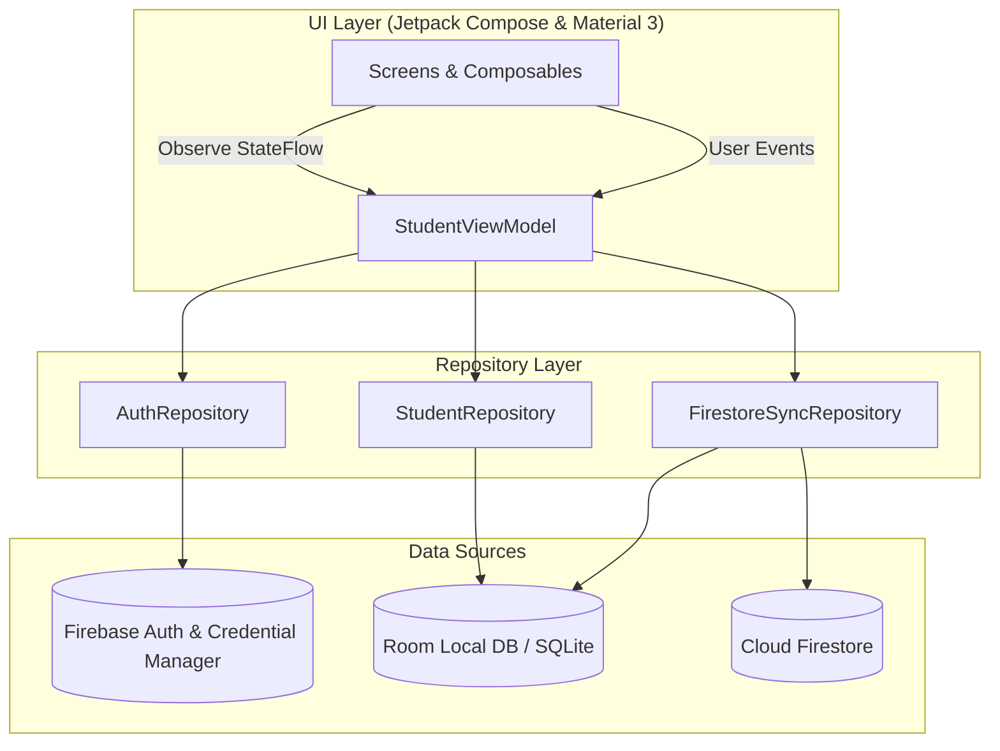

# UniTrack+ (大學生日常) 🎓

[-3DDC84?logo=android&logoColor=white)](https://developer.android.com)
[](https://kotlinlang.org/)
[](https://developer.android.com/jetpack/compose)
[-00599C?logo=sqlite&logoColor=white)](https://developer.android.com/training/data-storage/room)
[-FFCA28?logo=firebase&logoColor=black)](https://firebase.google.com/)
[](https://github.com/ZhaoHong04126/UniTrack)

> **專為大學生量身打造的全方位學業與生活管理助理。**  
> 集結「智慧週課表 & 考勤筆記」、「正課與課輔/實習時段獨立管理」、「整合行事曆與待辦日程」、「系統級上課推播提醒 (AlarmManager)」、「桌面今日課表小工具」、「畢業學分稽核與門檻檢核」、「GPA / 學業儀表板」、「個人記帳、帳戶互轉與月度預算（含自訂交易時間與預算刪除）」、「通知中心與雲端原子事務同步」、「深淺色主題切換」於一體，支援 100% 純本機離線隱私保護與 Firebase 雲端雙向同步。經由 R8 深度修剪，安裝包極致輕量 (11.5MB)。

---

## 📑 目錄

- [✨ 核心功能亮點](#-核心功能亮點)
- [📱 應用介面預覽](#-應用介面預覽)
- [🏆 開發成果與版本歷程 (Changelog)](#-開發成果與版本歷程-changelog)
- [🏗️ 技術架構](#️-技術架構)
- [📂 專案目錄結構](#-專案目錄結構)
- [🚀 快速開始](#-快速開始)
  - [環境需求](#環境需求)
  - [專案建置與執行](#專案建置與執行)
  - [Firebase 與環境設定](#firebase-與環境設定)
- [📊 功能模組詳解](#-功能模組詳解)
  - [1. 儀表板與學業概況 (Dashboard)](#1-儀表板與學業概況-dashboard)
  - [2. 智慧週課表、課輔管理與考勤筆記 (Timetable & Attendance)](#2-智慧週課表課輔管理與考勤筆記-timetable--attendance)
  - [3. 整合行事曆與個人待辦日程 (Calendar & Tasks)](#3-整合行事曆與個人待辦日程-calendar--tasks)
  - [4. 成績登錄與 GPA 試算 (Grades & GPA)](#4-成績登錄與-gpa-試算-grades--gpa)
  - [5. 畢業審查與學分稽核 (Graduation Audit)](#5-畢業審查與學分稽核-graduation-audit)
  - [6. 個人記帳、精準時間、帳戶互轉與預算管理 (Expense & Budget)](#6-個人記帳精準時間帳戶互轉與預算管理-expense--budget)
  - [7. 通知中心、版本偵測與雲端安全同步 (Auth, Notification & Sync)](#7-通知中心版本偵測與雲端安全同步-auth-notification--sync)
  - [8. 外觀主題與個人化設定 (Theme & Appearance)](#8-外觀主題與個人化設定-theme--appearance)
  - [9. 桌面小工具 (App Widgets)](#9-桌面小工具-app-widgets)
- [🧪 測試與品質保證](#-測試與品質保證)
- [🗺️ 未來展望 (Phase 2 Roadmap)](#️-未來展望-phase-2-roadmap)

---

## ✨ 核心功能亮點

* 📅 **智慧排課、小時制解析與多元顯示**：
  * 支援 **「顯示時間」與「顯示節次」雙模式一鍵切換**，全面採用直覺的**小時制課程時間計算與排版**。
  * 視覺化週課表排程，1~14 節自訂節次、單雙週/自訂週次設定、開學與結束日期動態計算、週末顯示開關。
  * 支援批次排課與**高質感課表分享長圖生成（附帶週數、時間區間與日期）**。
* 🧑‍🏫 **正課與課輔/實習時段獨立管理 (Tutorial Classes - Room DB v9)**：
  * 課程編輯支援附加「🧑‍🏫 課輔 / 實習時段 (TA)」，可個別指定上課星期、節次、教室與週次，自動設為 0 學分。
  * 課表卡片、長圖生成與課程詳情面板以專屬徽章清晰標註「課輔」；衝堂警示精準提示正課或課輔衝突。
  * **成績與學分智慧淨化**：成績登錄 (`GradeEntryScreen`) 與畢業審查清單 (`CourseAuditListScreen`) 自動過濾排除課輔時段，杜絕 0 學分課堂干擾 GPA 與學分審查。
* 🔄 **彈性週次重複模式 (Flexible Repeat Weeks & Modes)**：
  * 支援「每週」、「單週」、「雙週」與「指定週次」（如第 1~8 週、第 9~16 週或任意自訂週次選取）。
  * 各時段（正課、課輔）可各自獨立設定不同的上課週次模式。
  * 週課表、行事曆與桌面小工具 (`TodayScheduleWidget`) 依開學週次動態過濾並精準呈現當週課堂，全面支援 Firestore 雲端雙向同步。
* 💳 **多帳戶間自由轉帳與資金調撥 (Account Transfer)**：
  * 新增專屬帳戶轉帳對話框 (`AccountTransferDialog`)，支援在現金、銀行、信用卡、LINE Pay 等帳戶間一鍵轉帳。
  * 支援 `TRANSFER_OUT`（轉出）與 `TRANSFER_IN`（轉入）成對雙向關聯，清楚呈現資金流向。
  * **單卡整合視覺化呈現**：記帳明細列表將成對的轉帳紀錄智慧合併為單一張卡片（`轉出帳戶 ➔ 轉入帳戶`），點選即可展開專屬「內部資金調撥路線圖」對話框，詳細呈現資金流向與雙帳戶。
  * **預算與圖表隔離機制**：內部資金調撥精確反映於各帳戶累積餘額，並自動排除於月度總花費、預算進度條與收支圓餅圖 (`ExpenseDonutChart`) 外，杜絕虛增開銷。
* 🗑️ **月度預算彈性自訂與刪除 (Budget Management)**：
  * 支援設定月度總預算與動態預警進度條；新增**刪除預算**功能，隨時解除預算限制回歸自由記帳。
* 🚀 **版本自動檢查與更新服務 (UpdateChecker)**：
  * 串接 GitHub Releases API，可自動偵測雲端最新釋出版本與前 10 行更新日誌，隨時獲取最新功能。
* ⏰ **系統級上課推播提醒與開機自動重排 (AlarmManager)**：
  * 結合 Android 底層 `AlarmManager`，課前精準發送系統級推播提醒（如課前 15 分鐘），避免錯過重要課堂。
  * 註冊開機廣播接收器 (`BootCompletedReceiver`)，設備重啟後自動重新排程全部提醒，穩定可靠。
  * 通知偏好設定頁提供**測試發送推播**功能，方便隨時檢驗通知權限與呈現效果。
* 🧩 **桌面今日課表小工具 (App Widget)**：
  * 提供「今日課表」桌面小工具 (`TodayScheduleWidget`)，無需開啟 App 即可於手機主畫面速覽今日課堂、節次、教室與時間。
  * 整合專屬小工具設定頁面 (`WidgetSettingsScreen`)。
* 🗓️ **整合行事曆與待辦日程 (Calendar & Tasks)**：
  * **雙重視圖模式**：支援「月視圖 (Month View)」與「週視圖 (Week View)」無縫切換。
  * **學期課表自動整合**：課表課程無縫映射至每日行事曆時間軸，免除手動重排。
  * **個人重要日程與待辦**：支援自訂「學習、作業、考試、個人、活動、放假」等六大類別，具備色票標籤、倒數提醒與備註。
  * **待辦清單 (TODO)**：行程卡片支援點擊一鍵打勾標記完成/未完成，直覺好掌控。
* 📝 **考勤上課日期精準預測與隨堂筆記**：點選課表即刻展開詳情面板，**自動推算並標示每週對應之實際即將上課日期與出席狀態**（出席、遲到、曠課、請假）與統計圖表；支援依週次與標籤分類管理隨堂筆記。
* 🎓 **深度學分審查與畢業稽核 (Room DB v9)**：
  * 涵蓋校共同、院核心、系專業（基礎/核心/專業模組）、通識、自由選修等全方位分類。
  * **支援自訂分類與已刪除分類過濾 (`deletedCategories`)**，並在審查清單中**清楚標示重修課程**與通過學分。
  * 支援必修/選修獨立門檻目標設定與進度條即時計算。
* 📋 **畢業門檻檢核清單**：支援外語檢定 (TOEIC/TOEFL)、服務學習、畢業專題、專業證照等項目狀態追蹤與佐證紀錄。
* 📈 **成績登錄與多元 GPA 運算**：支援百分制、4.3 制與 4.0 制等計算標準，即時試算各學期平均分數與歷年累計 GPA；新增**不採計成績**選項與**批次儲存**功能，成績變更自動觸發推播通知。
* 📊 **動態學業進度計算**：儀表板根據學期 GPA 與通過狀態動態更新已通過學分，呈現精準學分累計進度。
* 🧠 **學期管理智慧化**：支援**學期權重解析演算法**，依學年度與學期類別（上/下/暑）智慧排序與時序比較；**自動依當前系統日期判定主要學期**；支援學期刪除（含課程連動清除與雲端同步）。
* 🎨 **深色 / 淺色 / 跟隨系統全域主題 (App Theme Modes)**：設定頁提供「跟隨系統」、「淺色模式」、「深色模式」即時切換，針對 Material 3 色彩系統與護眼對比進行全面適配。
* 📚 **課程錄入體驗優化**：課程對話框新增 **0.0 ~ 10.0 學分下拉選單**，輸入更快速直覺；Google 登入提供親切的人性化錯誤提示引導。
* 💰 **生活記帳、精準時間與多帳戶管理**：
  * **雙檢視模式**：支援「列表視圖」與「月曆視圖 (Calendar View)」。
  * **自訂交易時間**：時間選擇器 (`TimePickerDialog`) 可精確指定消費時與分，記帳明細時間軸更清晰。
  * **年月選擇器**：任意跨月份查看歷史收支與月曆分佈。
  * **多支付帳戶管理**：支援自訂現金、銀行帳戶、電子支付，具備**啟用起始年月**設定與**歷史累積餘額精準運算**。
  * **預算警戒機制**：月度預算動態消耗進度條、超支即時提醒與支出玫瑰色負號標記。
* 🔄 **雲端原子事務同步 (Atomic Transaction Sync)**：
  * 課程、記帳與畢業門檻同步導入 Room `@Transaction` 原子事務，保證雲端雙向同步時的資料完整性與強一致性。
  * 整合 Firebase Auth 與 Cloud Firestore，具備智慧防覆蓋保護機制，支援多裝置一鍵備份與還原。
* 🔔 **通知中心與雲端雙向持久化**：
  * **本地 Room 資料庫整合**：所有通知完整落地儲存，支援**未讀計數**與紅點標示。
  * **完整管理操作**：支援**依類型分類篩選**、**單則向左滑動刪除**、**一鍵全部標示為已讀**，以及**本機與 Firestore 雲端雙向一鍵清空所有通知**。
* ⚡ **效能極致最佳化與安全強化**：
  * **R8 / ProGuard 深度修剪**：全面啟用程式碼混淆與資源剪裁，安裝包體積由 32MB 降至 **11.5MB**（瘦身達 64%），兼具極速啟動與防逆向安全。
  * **現代化 Credential Manager**：升級至 Google 官方推薦之最新憑證管理員與 Google ID Token 認證機制，登入過程快速流暢。
* 🔒 **隱私至上 & 訪客模式 (Guest Mode)**：無須註冊登入即可 100% 離線使用，所有資料安全儲存於手機本機 SQLite (Room) 資料庫。
* 🎨 **全新品牌視覺識別 (Brand Logos)**：提供專屬設計之圓形、方形與透明背景高解析向量 SVG 與 PNG 圖標資源。

---

## 📱 應用介面預覽

<!-- 💡 提示：將螢幕截圖放置於 docs/images/ 對應檔名後，取消註解  標籤即可直接呈現 -->

| 儀表板 (Dashboard) | 智慧週課表 (Timetable) | 整合行事曆 (Calendar) |
| :---: | :---: | :---: |
| 📸 `docs/images/dashboard_preview.png`<br>*(待置入圖片)*<br><!--  --> | 📸 `docs/images/timetable_preview.png`<br>*(待置入圖片)*<br><!--  --> | 📸 `docs/images/calendar_preview.png`<br>*(待置入圖片)*<br><!--  --> |

| 考勤與筆記 (Attendance/Notes) | 畢業審查 (Graduation Audit) | 個人記帳與月曆 (Expense Tracker) |
| :---: | :---: | :---: |
| 📸 `docs/images/attendance_preview.png`<br>*(待置入圖片)*<br><!--  --> | 📸 `docs/images/graduation_preview.png`<br>*(待置入圖片)*<br><!--  --> | 📸 `docs/images/expense_preview.png`<br>*(待置入圖片)*<br><!--  --> |

| 通知中心 (Notification Center) | 外觀與同步 (Settings & Theme) | 官方品牌標誌 (Brand Logos) |
| :---: | :---: | :---: |
| 📸 `docs/images/notification_preview.png`<br>*(待置入圖片)*<br><!--  --> | 📸 `docs/images/settings_preview.png`<br>*(待置入圖片)*<br><!--  --> | 📸 `logo/app_logo_rounded_512.png`<br>*(已提供向量與點陣)*<br><!--  --> |

---

## 🏆 開發成果與版本歷程 (Changelog)

### 🔖 版本歷程記錄

#### 🌟 v2.3.0 (最新發布)
- 💳 **帳戶轉帳功能與費用處理流程全面升級**：
  - 新增 `AccountTransferDialog` 帳戶轉帳對話框，支援不同支付帳戶間快速調撥資金（如提款、儲值悠遊卡、銀行帳戶互轉）。
  - `ExpenseType` 新增 `TRANSFER_OUT`（轉出）與 `TRANSFER_IN`（轉入），雙向關聯紀錄在收支明細中一目了然。
  - **轉帳卡片單一化與視覺路線圖**：記帳明細列表自動將成對的轉帳紀錄合併為單一卡片顯示（`轉出帳戶 ➔ 轉入帳戶`），點擊即可開啟專屬詳情對話框，以路線圖視覺呈現內部資金調撥路徑與資訊。
  - **預算與圖表精準隔離**：轉帳紀錄精準納入各帳戶餘額試算，並自動排除於月度開銷預算進度條與圓餅圖 (`ExpenseDonutChart`) 之外，保障記帳統計真實性。
  - 在 `StudentViewModel` 實作 `transferBetweenAccounts` 與 `updateTransfer`，提供編輯、撤銷與刪除轉帳的完整管理流程。
- 🗑️ **月度預算彈性刪除功能**：
  - 在 `ExpenseDao` 與 `StudentRepository` 新增 `deleteBudget` / `deleteMonthlyBudget` 方法，支援隨時清除特定年月份之預算設定。
- 🚀 **GitHub Release 版本自動偵測服務**：
  - 新增 `UpdateChecker` 工具模組，自動比對 GitHub 最新發布版本並提取更新日誌，便於後續版本提示與線上更新。

#### 🌟 v2.2.0
- 🧑‍🏫 **課輔 / 實習時段獨立管理 (Tutorial Class - Room DB v9)**：
  - 資料庫升級至 Version 9（`MIGRATION_8_9`），`Course` 資料實體新增 `isTutorial` 欄位。
  - 課程新增/編輯對話框支援一鍵新增「🧑‍🏫 課輔 / 實習時段 (TA)」，自訂專屬上課時間、教室與週次模式，且自動設定為 0 學分。
  - 課表卡片、長圖導出與課程詳情底部面板新增專屬「課輔」徽章標籤與高識別度主題樣式。
  - 成績登錄畫面 (`GradeEntryScreen`) 與畢業審查清單 (`CourseAuditListScreen`) 全面過濾排除課輔課程，杜絕無學分時段干擾 GPA 計算與學分累計。
  - 課程衝堂檢驗邏輯升級，衝突時精準辨識並提示「正課」或「課輔」重疊，防止誤排課。
- 🔄 **擴充週次重複模式 (Repeat Weeks & Modes)**：
  - 課程與各時段支援設定 `repeatWeeks` 與 `repeatMode`（每週、單週、雙週、指定週次）。
  - 週課表、行事曆與桌面小工具 (`TodayScheduleWidget`) 依開學週數自動動態過濾並僅展示當週進行之課堂。
  - Firestore 雲端雙向同步全面支援 `isTutorial`、`repeatWeeks` 與 `repeatMode` 屬性。

#### 🌟 v2.1.0
- ⏰ **AlarmManager 系統級上課推播提醒與開機自動重排**：
  - 實現精準課前定時推播 (`CourseReminderReceiver`)，透過 Android `AlarmManager` 於課前設定時間（如 15 分鐘前）準時觸發上課提醒。
  - 新增開機廣播接收器 (`BootCompletedReceiver`)，設備重新開機時自動重新排程所有未過期之課堂鬧鐘提醒。
  - 通知設定頁面 (`NotificationSettingsScreen`) 新增「發送測試推播」按鈕，方便即時檢測系統通知權限與呈現效果。
- 🕒 **小時制課程時間解析與長圖生成優化**：
  - 重構課程時間解析與顯示架構，全面改用直覺的小時制時段呈現與精確時間跨度計算。
  - 大幅優化課表分享圖片生成器 (`TimetableImageGenerator`)，時間軸、週數與日期區間渲染更加清晰細緻。
- 🔄 **Room 原子事務保證 (@Transaction) 雲端同步一致性**：
  - 於 `CourseDao`、`ExpenseDao`、`GraduationDao` 導入 `@Transaction` 原子操作。
  - 與 Cloud Firestore 雙向同步時以單一原子事務批次寫入，確保 ACID 強一致性，杜絕網路異常造成資料破碎。
- 📊 **儀表板動態學分累計運算**：
  - 儀表板 (`DashboardScreen`) 學分累計邏輯升級，根據學期 GPA 與合格狀態動態計算已通過學分，呈現真實學業進展。
- 🎓 **畢業審查重修標示與課程清單增強**：
  - 課程審查清單 (`CourseAuditListScreen`) 清楚標記重修課程與已獲得學分，修業完成度更直覺透明。
- 🧩 **今日課表桌面小工具 (TodayScheduleWidget) 整合**：
  - 支援桌面小工具即時呈現今日課程、節次、教室與時間，並整合專屬小工具設定頁 (`WidgetSettingsScreen`)。

#### 🌟 v2.0.0
- 🗓️ **全新「行事曆 (Calendar)」模組集成**：
  - 新增底導航專屬「行事曆」頁面，支援「月視圖 (Month View)」與「週視圖 (Week View)」流暢切換。
  - 整合當前學期課表每日時段與個人日程事件（學習、作業、考試、個人、活動、放假等六大類別與自訂色票）。
  - 待辦事項支援一鍵點擊標記完成/未完成 (`isCompleted`)，底部即時聯動展示選取日期的課堂與日程清單。
  - 建立 `CalendarDao` 與 `CalendarEvent` 實體，由 Room 本地持久化保存並以 StateFlow 響應式串流。
- 🎨 **全域主題模式設定 (Theme Modes)**：
  - 設定頁新增主題切換功能，提供「跟隨系統」、「淺色模式」與「深色模式」三種狀態。
  - 全面適配 Material 3 色彩語意與深色模式高對比護眼調色，支援無縫熱切換並持久化儲存。
- 🧠 **學期智慧排序與當前學期自動判定**：
  - 實作學期權重解析演算法，支援學期字串（如 113-1、113-2、114-1）之權重排序與時序比較。
  - 依據當前系統日期智慧自動判定並切換至主要學期，減少手動切換與排課繁瑣流程。
- 📝 **考勤管理進化：上課日期與狀態精確預覽**：
  - 依據開學日期與各週進度，精準計算並顯示每週即將到達的上課實際月日。
  - 優化考勤卡片與出席狀態標示（出席、遲到、曠課、請假），出席統計圖表更直覺。
- 🎓 **畢業計畫資料庫架構升級 (Room DB v7)**：
  - 資料庫版本由 6 升級至 7，新增 `deletedCategories` 遷移機制，支援自訂學分分類刪除與跨模組連動過濾。
  - 使用者個人檔案模型增強，新增 `createdAt` 首次登入時間戳記並於設定頁展示。
- 📚 **課程錄入優化與 Google 登入體驗改善**：
  - 課程新增與編輯對話框新增 **0.0 ~ 10.0 學分下拉選單**，避免手動鍵盤誤觸。
  - 更新 Google 登入錯誤捕捉與處理邏輯，提供清楚親切的錯誤導引訊息。
- 🔔 **通知中心雲端雙向同步與一鍵清空**：
  - 實作「從雲端刪除所有通知」邏輯，一鍵清空本機時同步清理 Firestore 遠端記錄。
- 🎨 **專屬品牌視覺標誌 (Official Logos)**：
  - 新增 `logo/` 目錄，提供官方圓形 (Rounded)、方形 (Square) 及透明背景 (Transparent) 之高品質向量 SVG 與高解析度 PNG (512px / 1024px) 圖標檔案。

#### 🌟 v1.7.3
- ⚡ **R8 / ProGuard 深度程式碼混淆與資源剪裁**：
  - 啟用 `isMinifyEnabled` 與 `isShrinkResources`，配合完整的混淆保留規則（Room、Moshi、Firebase、Coroutines、Credential Manager 等）。
  - APK 安裝包體積由原本 32MB 驟降至 **11.5MB**（大幅瘦身 64%），兼顧極速啟動與防逆向安全。
- 🔑 **Google 登入機制現代化升級**：
  - 全面遷移至 Android 現代化 **Credential Manager (憑證管理員)** 與 Google ID Token 授權架構。
  - 配置 `res/raw/keep.xml` 防止 R8 最佳化誤刪憑證驗證關鍵類別，保障登入流程穩定。
- 🔔 **通知中心本地資料庫持久化與管理強化**：
  - 新增本地 Room `NotificationDao` 與通知實體，通知完整落地儲存，並支援 Firestore 雲端雙向同步。
  - 支援**已讀/未讀狀態**、**未讀數量即時紅點**、**通知類型分類篩選**、**單筆向左滑動刪除**與**全部標記已讀/清空通知**功能。
- ⏰ **記帳時間精準選取**：
  - 記帳對話框新增 `TimePickerDialog`，支援自訂記帳時間（時:分），日期與時間分開獨立選取與呈現。

#### 🌟 v1.5.1
- 🧹 **課表模組重構與精簡**：
  - 移除實驗性質的課表照片辨識導入流程，精簡 UI 架構，專注於手動排課與課表核心排程體驗。
  - 優化課程卡片外觀（調整卡片圓角、高度陰影），並簡化學期標題顯示邏輯。

#### 🌟 v1.5.0
- 🤖 **Gemini AI 課表照片智慧導入**：從手機相簿選取課表截圖，由 Gemini AI 自動辨識並批次建立課程（含課程名稱、教室、節次、學分）。支援圖片前處理（縮放 + Base64 編碼）與完整錯誤處理機制。
- 📷 **課表圖片匯入流程優化**：統一預設課程背景色為灰色，方便使用者匯入後自行標色；相簿選圖流程加入完整相片存取權限請求。
- 📈 **成績系統大升級**：
  - 新增**不採計成績**選項，彈性排除特定課程不計入 GPA。
  - 支援**批次儲存**成績，儲存後自動觸發成績變更推播通知。
  - 優化學期 GPA 計算邏輯，精準處理不採計課程與學分加權。
- 📅 **學期管理強化**：支援學期刪除（含課程連動批次清除與雲端同步）、依學年度與學期（上/下/暑）智慧排序學期列表。
- 🔔 **通知中心大升級**：通知卡片升級為可展開/收合設計，清晰呈現每則異動細項清單，並支援直接跳轉至對應功能頁面。
- 🧹 **介面簡化**：移除設定頁桌面小工具導航入口；成績輸入畫面移除多餘的畢業審查跳轉按鈕，介面更精簡直覺。

#### 🌟 v1.3.0
- 🤖 **Gemini AI 課表照片智慧導入（初版）**：新增從手機相簿選取課表截圖，透過 Gemini AI 自動辨識課程資訊並批次建立課程，整合圖片縮放與 Base64 編碼前處理與完整 JSON 錯誤處理機制。
- 📷 **課表圖片匯入 UI**：新增圖片匯入對話框 (`TimetableImageImportDialog`)，整合手動輸入與圖片匯入雙入口的展開式 FAB 選單。

#### 🌟 v1.2.0
- 🕒 **課表顯示模式切換**：新增課表時間/節次顯示切換功能，可自由選擇顯示實際時間區間或節次編號。
- 📤 **課表分享資訊增強**：課表匯出與分享時新增當前週數與精確日期區間（例如：第 1 週 2026/08/24 ~ 2026/08/30）。
- ℹ️ **設定畫面版本顯示**：設定頁面底端新增應用程式版本號標註 (`v1.2.0`)。
- ➕ **課表浮動操作按鈕 (FAB) 升級**：新增可展開/收合動畫選單，點擊後展現「手動輸入課程」選項，操作體驗更直覺。
- 💳 **記帳 FAB 動畫展開選單**：記帳頁快速新增按鈕改為展開式設計，支援展開/收合動畫，顯示「手動輸入」快速記帳入口。

#### 🌟 v1.1.0
- 📅 **年月選擇器**：記帳畫面新增月份切換功能，可查看任一歷史年月的消費與明細。
- 💳 **帳戶起始年月與累積餘額**：自訂帳戶支援設定「起始年月」，支出計算精準支援累積餘額追蹤。
- 🔔 **即時推播通知強化**：記帳收支異動即時推播、帳戶名稱與餘額變更通知、首次登入歡迎通知。
- 🎨 **視覺介面優化**：總支出金額加上負號標記 (`-`) 並更新為玫瑰色警示。

#### 🌟 v1.0.0 (第一階段里程碑)
- 🎓 **六大核心系統完整交付**：智慧週課表、考勤筆記、畢業學分審查、百分制 GPA 儀表板、生活記帳、Firebase 雲端同步與訪客離線隱私保護。

---

## 🏗️ 技術架構

UniTrack+ 遵循 **Modern Android Architecture (MVVM + Clean Architecture)** 開發範式與 Unidirectional Data Flow (UDF) 原則：



### 技術堆疊與依賴庫

| 領域 | 使用技術 / 函式庫 | 說明 |
| :--- | :--- | :--- |
| **程式語言** | Kotlin 2.0+ | 現代化、強型別、空安全保證之 Android 核心開發語言 |
| **UI 介面** | Jetpack Compose + Material 3 | 現代化宣告式 UI 框架、動態 Material You 配色、深淺色主題與 Edge-to-Edge 全螢幕適配 |
| **非同步與狀態** | Kotlin Coroutines + Flow / StateFlow | 響應式資料流與生命週期感知之全域狀態管理 |
| **本機資料庫** | Android Jetpack Room + KSP (v9) | 型別安全的 SQLite 物件關聯映射 (ORM) 與高效資料庫存取 (含課程、課輔、行事曆日程、畢業計畫、記帳、通知) |
| **雲端認證** | Firebase Auth + Credential Manager | 現代化 Google ID Token 憑證授權與 Email/Password 帳號驗證體系 |
| **雲端資料庫** | Cloud Firestore | 具備離線快取與跨設備即時雙向資料同步能力之 NoSQL 資料庫 |
| **建置與混淆** | R8 + ProGuard | 程式碼與無效資源深度修剪 (APK 瘦身至 11.5MB)、型別安全與防逆向防護 |
| **測試框架** | JUnit 4 + Robolectric + Roborazzi | 本機 JVM 單元測試與像素級 UI 截圖對比測試 (Screenshot Testing) |

---

## 📂 專案目錄結構

```text
UniTrack+/
├── app/
│   ├── src/
│   │   ├── main/
│   │   │   ├── java/com/example/
│   │   │   │   ├── MainActivity.kt               # 主入口點與 Jetpack Compose Navigation 路由導航 (包含行事曆)
│   │   │   │   ├── data/
│   │   │   │   │   ├── local/                    # Room Database (v9), TypeConverters, DAOs (Course, Calendar, Graduation, Expense, Notification)
│   │   │   │   │   ├── model/                    # 資料實體 (Entities, CalendarEvent, Enums, AuthModels, CourseNote, CustomAccount, AppNotification)
│   │   │   │   │   └── repository/               # StudentRepository, AuthRepository (Credential Manager), FirestoreSyncRepository
│   │   │   │   ├── receiver/                     # 系統廣播接收器 (BootCompletedReceiver, CourseReminderReceiver)
│   │   │   │   ├── widget/                       # 桌面小工具 (TodayScheduleWidget, WeeklyGridBitmapRenderer)
│   │   │   │   ├── ui/
│   │   │   │   │   ├── components/               # 通用 UI 元件 (統計卡片、進度條、彈出對話框)
│   │   │   │   │   ├── screens/
│   │   │   │   │   │   ├── auth/                 # 登入與註冊介面 (Google 憑證管理員 / Email / 訪客模式)
│   │   │   │   │   │   ├── dashboard/            # 學業進度 (動態已修與 GPA 計算) 與生活綜合儀表板
│   │   │   │   │   │   ├── timetable/            # 課表視圖、小時制時間/節次切換、課輔時段、考勤上課日標示、隨堂筆記、成績登記
│   │   │   │   │   │   ├── calendar/             # 全新整合行事曆 (週/月視圖、課表與日程整合、待辦打勾管理)
│   │   │   │   │   │   ├── graduation/           # 畢業審查、學分分類檢核 (支援自訂/刪除分類、排除課輔、重修標註)、學分設定、畢業門檻
│   │   │   │   │   │   ├── expense/              # 個人記帳、交易時間選取、月曆視圖、多帳戶管理與帳戶互轉 (AccountTransferDialog)
│   │   │   │   │   │   ├── notification/         # 通知中心、分類篩選、未讀標記、滑動刪除、雲端雙向清空
│   │   │   │   │   │   └── settings/             # 帳號設定、主題模式 (深/淺/系統)、桌面小工具設定、測試推播、雲端同步
│   │   │   │   │   ├── theme/                    # Material 3 色彩系統、深淺色切換、字型排版與主題配置
│   │   │   │   │   └── viewmodel/                # StudentViewModel (全域狀態、學期智慧排序、上課推播排程與業務核心)
│   │   │   │   │   └── util/                     # NotificationScheduler, NotificationHelper, UpdateChecker, TimetableImageGenerator, DateTimeUtils
│   │   │   │   └── res/                          # 應用程式資源 (圖標、字串、主題樣式、raw/keep.xml)
│   │   └── test/                                 # Robolectric 單元測試與 Roborazzi 截圖測試
│   ├── proguard-rules.pro                        # R8 / ProGuard 混淆與保留規則
│   └── build.gradle.kts                          # App 模組建置設定 (R8 啟用、資源修剪、v2.3.0)
├── logo/                                         # 官方專屬品牌標誌 (圓形、方形、透明背景之向量 SVG 與 PNG)
├── docs/
│   └── images/                                   # README 相關螢幕截圖與展示資源
├── gradle/                                       # Gradle Wrapper 與 Version Catalog (libs.versions.toml)
├── .env.example                                  # 環境變數範本檔案
├── build.gradle.kts                              # 專案級 Gradle 建置設定
└── settings.gradle.kts                           # 模組宣告與套件儲存庫管理
```

---

## 🚀 快速開始

### 環境需求

* **Android Studio**: Ladybug / Koala 或更高版本
* **JDK**: OpenJDK 17 或 21
* **Android SDK**: 
  * `compileSdk`: 37
  * `minSdk`: 26 (Android 8.0+)
  * `targetSdk`: 37

### 專案建置與執行

1. **取得專案原始碼**
   ```bash
   git clone https://github.com/ZhaoHong04126/UniTrack.git
   cd UniTrack+
   ```

2. **在 Android Studio 中開啟**
   * 開啟 Android Studio，選擇 `Open` 並選取本專案目錄。
   * 等待 Gradle 完成相依套件下載與專案同步 (Sync Project with Gradle Files)。

3. **編譯並執行**
   * 連接實體 Android 裝置 (需開啟 USB 偵錯) 或啟動 Android 模擬器 (AVD)。
   * 點擊 Android Studio 工具列的 **Run 'app' (Shift + F10)** 或透過命令列建置：
     ```bash
     ./gradlew assembleDebug
     ```

### Firebase 與環境設定

本專案具備完整之離線優先機制：
1. **訪客模式 (離線運作)**：專案配置了 `googleServices.missing.passthrough=true`，即便未配置 `google-services.json`，應用程式仍可於**訪客模式 (Guest Mode)** 下正常運行所有本機功能。
2. **啟用雲端同步與 Google 登入**：
   * 前往 [Firebase Console](https://console.firebase.google.com/) 建立專案。
   * 新增 Android 應用程式（Package Name 為 `com.unitrack.app`）。
   * 下載 `google-services.json` 並放置於 `app/` 目錄中。
   * 於 Firebase 控制台啟用 **Authentication**（支援 Google 與 Email/密碼）及 **Cloud Firestore**。

---

## 📊 功能模組詳解

### 1. 儀表板與學業概況 (Dashboard)
* **今日課堂卡片**：根據當前學期狀態、開學週期與當前星期，自動呈現今日即將上的課程、節次、教室與授課教師。
* **學業概況速覽與動態學分累計**：即時呈現歷年累計 GPA、平均分數及**動態已修與通過學分進度**（結合各學期 GPA 與合格狀態即時動態過濾已通過學分）。
* **財務與生活動態**：顯示當月可用預算剩餘百分比與今日消費總覽。

<!-- 📸 [照片標記 1.1：儀表板畫面截圖] -->
<!-- <p align="center"></p> -->

---

### 2. 智慧週課表、課輔管理與考勤筆記 (Timetable & Attendance)
* **雙顯示模式切換**：支援切換「顯示時間 (例如 08:10~09:00)」或「顯示節次 (例如 第 1 節)」，滿足不同排程習慣。
* **小時制課程時間解析與排版**：
  * 全面重構課程時間解析架構，改以直覺小時制時鐘計算與呈現課程時段，時間軸排列更精準清晰。
  * 支援 1~14 節自訂節次、單雙週/自訂週次設定、開學與結束日期動態計算、週末顯示開關。
* **課輔與實習時段獨立管理 (Tutorial Class)**：
  * 課程新增/編輯對話框支援新增「🧑‍🏫 課輔 / 實習時段 (TA)」，自動設定為 0 學分，支援獨立設定上課教室、節次與週次模式。
  * 課表卡片、長圖導出與課程詳情底部面板標註「課輔」專屬徽章。
  * 衝堂檢測邏輯升級：衝堂時精準提示「正課」或「課輔」衝突，防範誤排課。
* **高彈性週次重複設定 (Repeat Weeks & Modes)**：
  * 支援設定「每週」、「單週」、「雙週」與「指定週次」（例如第 1~8 週、第 9~16 週或任意自訂週次選取）。
  * 各時段（正課、課輔）可各自獨立配置不同週次模式，課表與桌面小工具依開學週數動態精準過濾。
* **高解析課表長圖生成分享**：優化 `TimetableImageGenerator`，支援匯出附帶週次、精確起訖時間與日期之高質感課表長圖。
* **學期權重排序與當前學期智慧判定**：
  * 實作學期權重解析演算法，依學年度與學期類別（上/下/暑）智慧排序與時序比較。
  * 依據當前系統日期**自動判定並選取主要學期**，省去頻繁手動切換學期之麻煩。
  * 支援多學期動態切換、開學與結束日期精準設定、單雙週過濾與批次排課；支援**學期刪除**（連動清除課程並同步雲端）。
* **課程錄入體驗優化**：點擊新增按鈕展開課程編輯抽屜 (`AddEditCourseDialog`)，新增 **0.0 ~ 10.0 學分下拉選單**，避免手動鍵盤誤觸；排版圓角與高度陰影全面優化。
* **考勤點名管理 (Attendance Tracking)**：
  * **上課日期精準推估**：自動結合開學日期精算每週上課對應之實際月日，即時預覽即將到達的課堂日期與出缺席紀錄。
  * 提供每週課堂出席狀態登記（出席、遲到、曠課、請假），並自動統計出席率與各類考勤次數。
* **課程隨堂筆記 (Course Notes)**：
  * 支援分類管理：`一般`、`作業`、`考試`、`公告`、`重點`。
  * 可關聯特定週次與時間戳記，方便期中/期末考前快速複習。

<!-- 📸 [照片標記 2.1：週課表介面截圖] -->
<!-- <p align="center"></p> -->

<!-- 📸 [照片標記 2.2：考勤點名與筆記 BottomSheet 截圖] -->
<!-- <p align="center"></p> -->

---

### 3. 整合行事曆與個人待辦日程 (Calendar & Tasks)
* **雙重視圖模式**：提供「月視圖 (Month View)」與「週視圖 (Week View)」一鍵無縫切換，兼顧宏觀月曆規劃與細緻單週行程。
* **課表與行事曆自動融合**：系統依據當前學期之課表設定，自動將每週課程映射至對應日期的時間軸上，無需重複手動登錄。
* **個人重要日程管理**：
  * 支援自訂「學習、作業、考試、個人、活動、放假」等六大類別，具備專屬色彩標籤與分類色票。
  * 支援全天事件或設定精確開始與結束時間（HH:mm），包含地點與詳細筆記備忘。
* **待辦清單打勾完成 (TODO)**：日程事件卡片支援點擊一鍵切換完成/未完成狀態 (`isCompleted`)，高效追蹤各項作業與備考進度。
* **底部即時日程面板**：點擊日曆中任意日期，底部動態展開當日全部課程安排與待辦行程，清楚掌握一日計畫。

<!-- 📸 [照片標記 3.1：行事曆月視圖與週視圖截圖] -->
<!-- <p align="center"></p> -->

---

### 4. 成績登錄與 GPA 試算 (Grades & GPA)
* **成績管理與課輔自動排除**：
  * 支援百分制成績與等第成績（A+、A、B+ 等）輸入與即時計算。
  * **自動排除課輔/實習時段**：無學分之課輔時段不進入成績輸入介面，徹底杜絕無效數據干擾學期 GPA 運算。
* **多元計算機制**：預設百分制標準，並支援 4.3 制與 4.0 制換算，精準統計單學期與歷年累計 GPA / 平均分數。
* **不採計成績選項**：可將特定課程標記為「不採計」，彈性排除於 GPA 計算之外（如重修前成績）。
* **批次儲存與通知**：一次儲存多門課程成績，儲存後自動觸發成績變更推播通知，隨時掌握學業動態。

<!-- 📸 [照片標記 4.1：成績登記與 GPA 試算畫面截圖] -->
<!-- <p align="center"></p> -->

---

### 5. 畢業審查與學分稽核 (Graduation Audit)
* **自訂畢業學分門檻**：支援依各大專院校系所修業規範，彈性設定校共同、院核心、系專業（基礎/核心/專業模組）、通識與自由選修之總學分及**必修/選修細項門檻**。
* **自訂分類管理與清理 (Room DB v9)**：升級至資料庫版本 9，支援自訂學分分類與**刪除分類管理 (`deletedCategories`)**，被刪除之類別在排課與審查時自動過濾，保持介面簡潔乾淨。
* **排除課輔與重修課程清晰標示**：課程審查清單 (`CourseAuditListScreen`) 自動排除無學分課輔，並清楚標示重修課程與合格學分，完整呈現各類別門檻修畢狀態。
* **視覺化進度檢驗**：圖表化清晰比對「已修畢 (Earned)」、「修習中 (In-progress)」與「目標學分 (Target)」。
* **畢業門檻檢核清單**：支援自訂與追蹤外語檢定 (如 TOEIC/TOEFL)、服務學習、畢業專題、專業證照等非學分門檻。

<!-- 📸 [照片標記 5.1：畢業學分進度圖表截圖] -->
<!-- <p align="center"></p> -->

<!-- 📸 [照片標記 5.2：學分門檻設定對話框截圖] -->
<!-- <p align="center"></p> -->

---

### 6. 個人記帳、精準時間、帳戶互轉與預算管理 (Expense & Budget)
* **雙檢視模式與年月選擇**：支援「列表視圖」與「月曆視圖 (Calendar View)」，搭配「年月選擇器」隨時回溯任意歷史月份之消費明細與月曆收支。
* **精準交易時間選取**：記帳對話框提供日期與時間 (`TimePickerDialog`) 獨立選取機制，可自訂消費發生時與分，收支時間軸更加精準。
* **自訂多支付帳戶管理 (Multi-Account)**：
  * 支援自訂新增/編輯/刪除/排序支付帳戶（現金、各銀行帳戶、LINE Pay、街口、信用卡等）。
  * 支援設定**啟用起始年月 (Start Year-Month)**，精準計算歷史累積餘額。
  * 支援預設帳戶設定與雲端跨裝置同步。
* **帳戶間資金互轉與成對紀錄 (`AccountTransferDialog`)**：
  * 支援多帳戶自由轉帳，提供專屬轉帳對話框，直覺設定來源帳戶、目標帳戶、轉帳金額、交易日期與備註。
  * 底層自動建立成對之「轉出 (`TRANSFER_OUT`)」與「轉入 (`TRANSFER_IN`)」記錄，精確即時反映各帳戶最新餘額。
  * **單卡整合視覺化呈現**：收支明細列表自動將同筆轉帳之轉出與轉入合併為單一張卡片（`轉出帳戶 ➔ 轉入帳戶`），點選卡片開啟「內部資金調撥路線圖」對話框，清楚查看資金流向與雙帳戶資訊。
  * **預算與圖表隔離機制**：轉帳屬於個人內部資金調度而非實質消費，系統自動將轉帳收支排除於每月消費總額、預算進度條與圓餅圖 (`ExpenseDonutChart`) 之外，確保消費統計與超支警示真實無誤。
* **快速記帳、預算警戒與彈性預算刪除**：
  * 提供餐飲、交通、娛樂、學習、住宿等豐富標籤；總支出金額以玫瑰色負號標記；設定每月總預算，以動態進度條即時警示花費進度防範超支。
  * **月度預算支援直接刪除 (`deleteBudget`)**：若特定月份無需預算上限或設定有誤，可一鍵移除該月預算限制，恢復無預算上限狀態。

<!-- 📸 [照片標記 6.1：記帳明細、月曆視圖與預算進度條截圖] -->
<!-- <p align="center"></p> -->

---

### 7. 通知中心、帳號、版本偵測與雲端安全同步 (Auth, Notification & Sync)
* **系統級課程推播與定時排程 (AlarmManager)**：
  * 整合 Android 系統底層 `AlarmManager`，課前精準發送上課推播提醒（預設課前 15 分鐘）。
  * 註冊開機廣播接收器 (`BootCompletedReceiver`)，設備重新開機時自動重新排程所有上課提醒。
  * 通知設定頁面 (`NotificationSettingsScreen`) 新增「測試發送推播」操作，即時驗證通知權限與排程。
* **雲端原子事務同步 (ACID Transaction Sync)**：
  * 在 `CourseDao`、`ExpenseDao`、`GraduationDao` 實作 Room `@Transaction` 原子操作，確保與 Cloud Firestore 雲端雙向同步時具備強一致性。
* **通知中心本地與雲端雙向持久化**：
  * **Room 本地持久化**：通知落地儲存於本機 SQLite 資料庫 (`NotificationDao`)。
  * **已讀/未讀狀態管理**：提供未讀計數紅點，支援**一鍵標記全部已讀**與**單則向左滑動刪除**。
  * **本機與雲端同步清空**：支援一鍵清空所有通知，同時自本機 Room 與 Firebase Firestore 雲端雙向刪除。
  * **分類篩選與頁面聯動**：支援依類型標籤過濾，點擊卡片直接跳轉至對應功能頁面。
* **現代化 Google 登入 (Credential Manager)**：
  * 升級至 Google 最新 Android 憑證管理員與 Google ID Token 授權，提供清晰友善的錯誤導引訊息。
* **個人檔案與首次登入記錄**：支援自訂頭像與暱稱保存；記錄首次登入時間戳記 (`createdAt`)；清楚標示當前版本號 (`v2.3.0`)。
* **GitHub 最新版本自動偵測服務 (`UpdateChecker`)**：
  * 內建版本更新檢查機制，採用非同步排程請求 GitHub Releases API (`/repos/ZhaoHong04126/UniTrack/releases/latest`)。
  * 於設定或應用程式啟動時自動比對目前版本與線上最新發布版本，具備更新日誌摘要解析與版本更新提示引導。
* **免登入離線優先**：無需連網即可享受 100% 完整功能，所有資料本機加密保存。
* **雲端安全同步與跨裝置相容 (Cloud Sync)**：支援 Google / Email 帳號驗證；具備智慧防覆蓋保護機制；課程資料庫完整支援同步課輔 (`isTutorial`)、重複週次 (`repeatWeeks`) 與模式 (`repeatMode`)，跨裝置無縫同步。
* **標準 JSON 檔案匯出/匯入**：提供純文字 JSON 匯出與匯入功能，方便本機備份、跨設備遷移或手動分析。

<!-- 📸 [照片標記 7.1：通知中心介面截圖] -->
<!-- <p align="center"></p> -->

<!-- 📸 [照片標記 7.2：設定與雲端同步介面截圖] -->
<!-- <p align="center"></p> -->

---

### 8. 外觀主題與個人化設定 (Theme & Appearance)
* **全域主題模式切換**：
  * 提供「跟隨系統 (System)」、「淺色模式 (Light)」與「深色模式 (Dark)」三種模式。
  * 採用 Material 3 動態配色原則，深色模式具備低眩光高對比特質，夜間閱讀更舒適。
  * 主題選擇狀態於本地持久化保存，冷啟動時自動即時套用。
* **品牌專屬視覺識別**：
  * 全新設計官方應用程式 Logo，於 `logo/` 資料夾提供圓形、方形與透明背景的高解析 SVG 與 PNG 資源。

---

### 9. 桌面小工具 (App Widgets)
* **今日課表桌面速覽 (`TodayScheduleWidget`)**：
  * 無需開啟 App 即可於 Android 主畫面即時查看今日課堂安排、節次時段、教室與授課教師。
  * 支援當日無課狀態友善提示、點擊即刻啟動 App 直達當日課堂詳情。
  * 提供小工具專屬偏好設定介面 (`WidgetSettingsScreen`)。

---

## 🧪 測試與品質保證

本專案配置有單元測試、Robolectric 本機模擬測試與 Roborazzi 截圖測試：

* **執行單元測試 (Unit Tests & Robolectric)**：
  ```bash
  ./gradlew testDebugUnitTest
  ```
* **執行 Roborazzi 截圖對比驗證**：
  ```bash
  ./gradlew verifyRoborazziDebug
  ```
* **更新 / 錄製 Roborazzi 截圖基準檔**：
  ```bash
  ./gradlew recordRoborazziDebug
  ```

---

## 🗺️ 未來展望 (Phase 2 Roadmap)

* [ ] 🤖 **Gemini AI 智慧課表與隨堂助理**：重構課表截圖多模態解析流程，並支援課程筆記智慧摘要、個人化學習建議與期末備考指南。
* [x] 🧩 **桌面小工具 (App Widgets)**：今日課表速覽 (`TodayScheduleWidget`) 已正式交付；後續將擴展快速記帳小工具。
* [ ] 📸 **OCR / PDF 課表匯入**：支援上傳學校 PDF 課表或選課清單，自動解析並帶入課程資料。
* [ ] 📊 **進階財務分析圖表**：月度/年度收支圓餅圖、趨勢折線圖與開銷排行榜。

---
