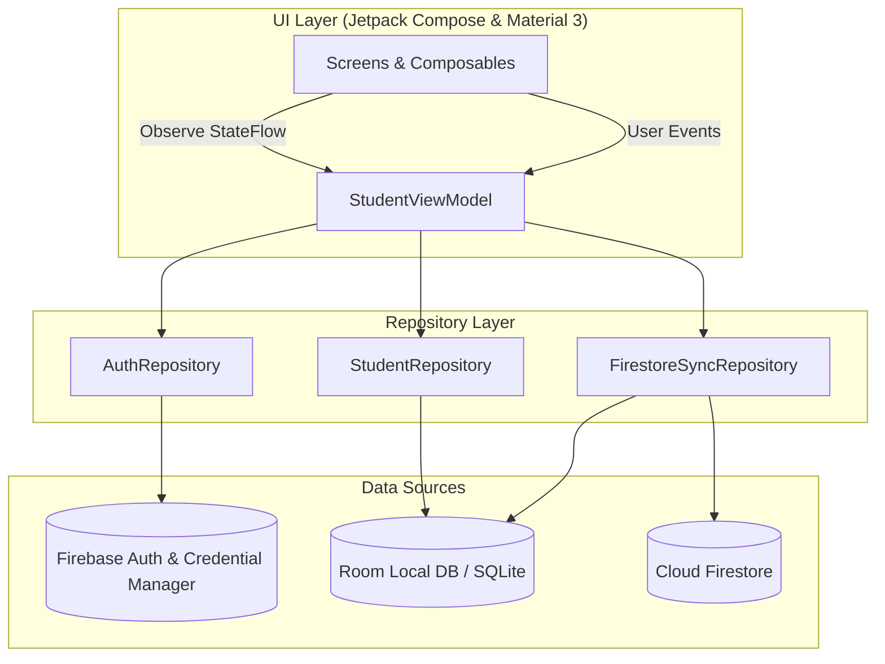

# UniTrack+ (大學生日常) 🎓

[-3DDC84?logo=android&logoColor=white)](https://developer.android.com)
[](https://kotlinlang.org/)
[](https://developer.android.com/jetpack/compose)
[-00599C?logo=sqlite&logoColor=white)](https://developer.android.com/training/data-storage/room)
[-FFCA28?logo=firebase&logoColor=black)](https://firebase.google.com/)
[](https://github.com/ZhaoHong04126/UniTrack)

> **專為大學生量身打造的全方位學業與生活管理助理。**  
> 集結「智慧週課表 & 考勤筆記」、「畢業學分稽核與門檻檢核」、「GPA / 學業儀表板」、「個人記帳與月度預算」於一體，支援 100% 純本機離線隱私保護與 Firebase 雲端雙向同步。

---

## 📑 目錄

- [✨ 核心功能亮點](#-核心功能亮點)
- [📱 應用介面預覽](#-應用介面預覽)
- [🏗️ 技術架構](#️-技術架構)
- [📂 專案目錄結構](#-專案目錄結構)
- [🚀 快速開始](#-快速開始)
  - [環境需求](#環境需求)
  - [專案建置與執行](#專案建置與執行)
  - [Firebase 與環境設定](#firebase-與環境設定)
- [📊 功能模組詳解](#-功能模組詳解)
  - [1. 儀表板 (Dashboard)](#1-儀表板-dashboard)
  - [2. 智慧週課表、考勤與課程筆記 (Timetable & Attendance)](#2-智慧週課表考勤與課程筆記-timetable--attendance)
  - [3. 成績登錄與 GPA 試算 (Grades & GPA)](#3-成績登錄與-gpa-試算-grades--gpa)
  - [4. 畢業審查與學分稽核 (Graduation Audit)](#4-畢業審查與學分稽核-graduation-audit)
  - [5. 個人記帳與預算管理 (Expense & Budget)](#5-個人記帳與預算管理-expense--budget)
  - [6. 帳號、資料同步與備份 (Auth & Data Management)](#6-帳號資料同步與備份-auth--data-management)
- [🧪 測試與品質保證](#-測試與品質保證)
- [📄 授權條款](#-授權條款)

---

## ✨ 核心功能亮點

* 📅 **智慧排課與即時檢視**：視覺化週課表排程、支援 1~14 節自訂節次、單雙週/自訂週次設定、開學週動態日期計算與今日課程快速卡片。
* 📝 **課程考勤與筆記管理**：點選課程即刻展開課程詳情面板，提供週次出席點名紀錄（出席、遲到、曠課、請假）與統計分析，並支援按週次與標籤（作業、考試、公告、重點）分類管理課程隨堂筆記。
* 🎓 **深度學分審查與畢業稽核**：涵蓋校共同、院核心、系專業（基礎/核心/專業模組）、通識、自由選修等全方位分類，支援必修/選修學分細項門檻設定與修習進度即時計算。
* 📋 **畢業門檻檢核清單**：支援外語檢定 (TOEIC/TOEFL)、服務學習、畢業專題、專業證照等項目狀態追蹤與佐證紀錄。
* 📈 **多元 GPA 運算引擎**：內建 4.3 制、4.0 制與百分制等多種 GPA 演算法，即時試算各學期與歷年累計 GPA 與平均分數。
* 💰 **生活記帳與預算監控**：多類別收支紀錄、付款方式管理、月度預算消耗進度條與超支警示。
* 🔒 **隱私優先 & 訪客模式 (Guest Mode)**：無須註冊登入即可離線使用，所有資料安全儲存於手機本機 SQLite (Room) 資料庫。
* ☁️ **雲端雙向同步 (Cloud Sync)**：整合 Firebase Auth（Google Sign-In 與 Email 登入）及 Cloud Firestore，支援多裝置一鍵備份與雲端還原。
* 📦 **JSON 格式備份與還原**：支援標準 JSON 格式本機一鍵匯出與匯入，方便資料備份與設備無痛遷移。

---

## 📱 應用介面預覽

<!-- 💡 提示：將螢幕截圖放置於 docs/images/ 對應檔名後，取消註解  標籤即可直接呈現 -->

| 儀表板 (Dashboard) | 智慧週課表 (Timetable) | 考勤與筆記 (Attendance/Notes) |
| :---: | :---: | :---: |
| 📸 `docs/images/dashboard_preview.png`<br>*(待置入圖片)*<br><!--  --> | 📸 `docs/images/timetable_preview.png`<br>*(待置入圖片)*<br><!--  --> | 📸 `docs/images/attendance_preview.png`<br>*(待置入圖片)*<br><!--  --> |

| 畢業審查 (Graduation Audit) | 個人記帳 (Expense Tracker) | 帳號與同步 (Settings & Sync) |
| :---: | :---: | :---: |
| 📸 `docs/images/graduation_preview.png`<br>*(待置入圖片)*<br><!--  --> | 📸 `docs/images/expense_preview.png`<br>*(待置入圖片)*<br><!--  --> | 📸 `docs/images/settings_preview.png`<br>*(待置入圖片)*<br><!--  --> |

---

## 🏗️ 技術架構

UniTrack+ 遵循 **Modern Android Architecture (MVVM + Clean Architecture)** 開發範式與 Unidirectional Data Flow (UDF) 原則：



### 技術堆疊與依賴庫

| 領域 | 使用技術 / 函式庫 | 說明 |
| :--- | :--- | :--- |
| **程式語言** | Kotlin 2.0+ | 現代化、強型別、空安全保證之 Android 核心開發語言 |
| **UI 介面** | Jetpack Compose + Material 3 | 現代化宣告式 UI 框架、動態 Material You 配色與 Edge-to-Edge 全螢幕適配 |
| **非同步與狀態** | Kotlin Coroutines + Flow / StateFlow | 響應式資料流與生命週期感知之全域狀態管理 |
| **本機資料庫** | Android Jetpack Room + KSP | 型別安全的 SQLite 物件關聯映射 (ORM) 與高效資料庫存取 |
| **雲端認證** | Firebase Authentication + Credential Manager | 支援 Google 帳號授權登入與 Email/Password 帳號驗證體系 |
| **雲端資料庫** | Cloud Firestore | 具備離線快取與跨設備即時雙向資料同步能力之 NoSQL 資料庫 |
| **測試框架** | JUnit 4 + Robolectric + Roborazzi | 本機 JVM 單元測試與像素級 UI 截圖對比測試 (Screenshot Testing) |

---

## 📂 專案目錄結構

```text
UniTrack+/
├── app/
│   ├── src/
│   │   ├── main/
│   │   │   ├── java/com/example/
│   │   │   │   ├── MainActivity.kt               # 主入口點與 Jetpack Compose Navigation 路由導航
│   │   │   │   ├── data/
│   │   │   │   │   ├── local/                    # Room Database, TypeConverters, DAOs (Course, Graduation, Expense)
│   │   │   │   │   ├── model/                    # 資料實體 (Entities, Enums, AuthModels, CourseNote)
│   │   │   │   │   └── repository/               # StudentRepository, AuthRepository, FirestoreSyncRepository
│   │   │   │   ├── ui/
│   │   │   │   │   ├── components/               # 通用 UI 元件 (統計卡片、進度條、彈出對話框)
│   │   │   │   │   ├── screens/
│   │   │   │   │   │   ├── auth/                 # 登入與註冊介面 (Google Sign-In / Email / 訪客模式)
│   │   │   │   │   │   ├── dashboard/            # 學業進度與生活綜合儀表板
│   │   │   │   │   │   ├── timetable/            # 課表視圖、課程增修、考勤點名、課程筆記、成績登記
│   │   │   │   │   │   ├── graduation/           # 畢業審查、學分分類檢核、學分設定、畢業門檻清單
│   │   │   │   │   │   ├── expense/              # 個人記帳、分類收支明細、月預算控制
│   │   │   │   │   │   └── settings/             # 帳號設定、雲端同步、JSON 檔案匯入/匯出
│   │   │   │   │   ├── theme/                    # Material 3 色彩系統、字型排版與主題配置
│   │   │   │   │   └── viewmodel/                # StudentViewModel (全域狀態與業務邏輯核心)
│   │   │   │   └── res/                          # 應用程式資源 (圖標、字串、主題樣式)
│   │   └── test/                                 # Robolectric 單元測試與 Roborazzi 截圖測試
│   └── build.gradle.kts                          # App 模組建置設定與依賴版本配置
├── docs/
│   └── images/                                   # README 相關螢幕截圖與展示資源
├── gradle/                                       # Gradle Wrapper 與 Version Catalog (libs.versions.toml)
├── .env.example                                  # 環境變數範本檔案
├── build.gradle.kts                              # 專案級 Gradle 建置設定
└── settings.gradle.kts                           # 模組宣告與套件儲存庫管理
```

---

## 🚀 快速開始

### 環境需求

* **Android Studio**: Ladybug / Koala 或更高版本
* **JDK**: OpenJDK 17 或 21
* **Android SDK**: 
  * `compileSdk`: 37
  * `minSdk`: 26 (Android 8.0+)
  * `targetSdk`: 37

### 專案建置與執行

1. **取得專案原始碼**
   ```bash
   git clone https://github.com/ZhaoHong04126/UniTrack.git
   cd UniTrack+
   ```

2. **在 Android Studio 中開啟**
   * 開啟 Android Studio，選擇 `Open` 並選取本專案目錄。
   * 等待 Gradle 完成相依套件下載與專案同步 (Sync Project with Gradle Files)。

3. **編譯並執行**
   * 連接實體 Android 裝置 (需開啟 USB 偵錯) 或啟動 Android 模擬器 (AVD)。
   * 點擊 Android Studio 工具列的 **Run 'app' (Shift + F10)** 或透過命令列建置：
     ```bash
     ./gradlew assembleDebug
     ```

### Firebase 與環境設定

本專案具備完整之離線優先機制：
1. **訪客模式 (離線運作)**：專案配置了 `googleServices.missing.passthrough=true`，即便未配置 `google-services.json`，應用程式仍可於**訪客模式 (Guest Mode)** 下正常運行所有本機功能。
2. **啟用雲端同步與 Google 登入**：
   * 前往 [Firebase Console](https://console.firebase.google.com/) 建立專案。
   * 新增 Android 應用程式（Package Name 為 `com.unitrack.app`）。
   * 下載 `google-services.json` 並放置於 `app/` 目錄中。
   * 於 Firebase 控制台啟用 **Authentication**（支援 Google 與 Email/密碼）及 **Cloud Firestore**。

---

## 📊 功能模組詳解

### 1. 儀表板 (Dashboard)
* **今日課堂卡片**：根據當前星期與時間自動呈現今日課表、節次、教室與授課教師。
* **學業概況速覽**：即時呈現歷年累計 GPA、平均分數及修習學分進度。
* **財務與生活動態**：顯示當月可用預算剩餘百分比與今日消費總覽。

<!-- 📸 [照片標記 1.1：儀表板畫面截圖] -->
<!-- <p align="center"></p> -->

---

### 2. 智慧週課表、考勤與課程筆記 (Timetable & Attendance)
* **視覺化課表視圖**：支援週一至週日、第 1 至 14 節網格排課，自訂色彩標籤避免視覺疲勞。
* **學期與週次管理**：支援多學期動態切換、開學日期設定與單雙週過濾。
* **考勤點名管理 (Attendance Tracking)**：
  * 提供每週課堂出席狀態登記（出席、遲到、曠課、請假）。
  * 自動統計出席率與各類考勤次數，隨時掌握出席狀況。
* **課程隨堂筆記 (Course Notes)**：
  * 支援分類管理：`一般`、`作業`、`考試`、`公告`、`重點`。
  * 可關聯特定週次與時間戳記，方便期中/期末考前快速複習。

<!-- 📸 [照片標記 2.1：週課表介面截圖] -->
<!-- <p align="center"></p> -->

<!-- 📸 [照片標記 2.2：考勤點名與筆記 BottomSheet 截圖] -->
<!-- <p align="center"></p> -->

---

### 3. 成績登錄與 GPA 試算 (Grades & GPA)
* **成績管理**：支援百分制成績與等第成績（A+、A、B+ 等）輸入與即時計算。
* **多元計算機制**：支援 4.3 制、4.0 制與百分制，精準換算單學期與歷年 GPA。

<!-- 📸 [照片標記 3.1：成績登記與 GPA 試算畫面截圖] -->
<!-- <p align="center"></p> -->

---

### 4. 畢業審查與學分稽核 (Graduation Audit)
* **自訂畢業學分門檻**：支援依各大專院校系所修業規範，彈性設定校共同、院核心、系專業（基礎/核心/專業模組）、通識與自由選修之總學分及**必修/選修細項門檻**。
* **視覺化進度檢驗**：圖表化清晰比對「已修畢 (Earned)」、「修習中 (In-progress)」與「目標學分 (Target)」。
* **畢業門檻檢核清單**：支援自訂與追蹤外語檢定 (如 TOEIC/TOEFL)、服務學習、畢業專題、專業證照等非學分門檻。

<!-- 📸 [照片標記 4.1：畢業學分進度圖表截圖] -->
<!-- <p align="center"></p> -->

<!-- 📸 [照片標記 4.2：學分門檻設定對話框截圖] -->
<!-- <p align="center"></p> -->

---

### 5. 個人記帳與預算管理 (Expense & Budget)
* **極速記帳**：提供餐飲、交通、娛樂、學習、住宿等豐富標籤，記錄支付方式與消費備註。
* **預算警戒機制**：設定每月總預算，以動態進度條即時警示花費進度，防範超支。

<!-- 📸 [照片標記 5.1：記帳明細與預算進度條截圖] -->
<!-- <p align="center"></p> -->

---

### 6. 帳號、資料同步與備份 (Auth & Data Management)
* **免登入離線優先**：無需連網即可享受完整功能，保障個人隱私。
* **雲端一鍵備份/還原**：登入 Google 帳號後，支援將課表、學分、記帳數據同步至 Cloud Firestore。
* **標準 JSON 檔案匯出/匯入**：提供純文字 JSON 匯出與匯入功能，方便本機備份、跨設備遷移或手動分析。

<!-- 📸 [照片標記 6.1：登入與雲端備份設定截圖] -->
<!-- <p align="center"></p> -->

---

## 🧪 測試與品質保證

本專案配置有單元測試、Robolectric 本機模擬測試與 Roborazzi 截圖測試：

* **執行單元測試 (Unit Tests & Robolectric)**：
  ```bash
  ./gradlew testDebugUnitTest
  ```
* **執行 Roborazzi 截圖對比驗證**：
  ```bash
  ./gradlew verifyRoborazziDebug
  ```
* **更新 / 錄製 Roborazzi 截圖基準檔**：
  ```bash
  ./gradlew recordRoborazziDebug
  ```
