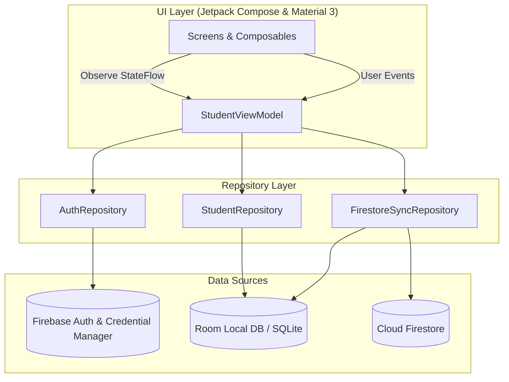

# UniTrack+ (大學生日常) 🎓

[-3DDC84?logo=android&logoColor=white)](https://developer.android.com)
[](https://kotlinlang.org/)
[](https://developer.android.com/jetpack/compose)
[-00599C?logo=sqlite&logoColor=white)](https://developer.android.com/training/data-storage/room)
[-FFCA28?logo=firebase&logoColor=black)](https://firebase.google.com/)
[](https://github.com/ZhaoHong04126/UniTrack)

> **專為大學生量身打造的全方位學業與生活管理助理。**  
> 集結「智慧週課表 & 考勤筆記」、「**Gemini AI 課表照片智慧導入**」、「畢業學分稽核與門檻檢核」、「GPA / 學業儀表板」、「個人記帳與月度預算」於一體，支援 100% 純本機離線隱私保護與 Firebase 雲端雙向同步。

---

## 📑 目錄

- [✨ 核心功能亮點](#-核心功能亮點)
- [📱 應用介面預覽](#-應用介面預覽)
- [🏆 開發成果與版本歷程 (Changelog)](#-開發成果與版本歷程-changelog)
- [🏗️ 技術架構](#️-技術架構)
- [📂 專案目錄結構](#-專案目錄結構)
- [🚀 快速開始](#-快速開始)
  - [環境需求](#環境需求)
  - [專案建置與執行](#專案建置與執行)
  - [Firebase 與環境設定](#firebase-與環境設定)
- [📊 功能模組詳解](#-功能模組詳解)
  - [1. 儀表板 (Dashboard)](#1-儀表板-dashboard)
  - [2. 智慧週課表、考勤與課程筆記 (Timetable & Attendance)](#2-智慧週課表考勤與課程筆記-timetable--attendance)
  - [3. 成績登錄與 GPA 試算 (Grades & GPA)](#3-成績登錄與-gpa-試算-grades--gpa)
  - [4. 畢業審查與學分稽核 (Graduation Audit)](#4-畢業審查與學分稽核-graduation-audit)
  - [5. 個人記帳、月曆視圖與多帳戶管理 (Expense & Budget)](#5-個人記帳月曆視圖與多帳戶管理-expense--budget)
  - [6. 通知設定、帳號與雲端安全同步 (Auth, Notification & Sync)](#6-通知設定帳號與雲端安全同步-auth-notification--sync)
- [🧪 測試與品質保證](#-測試與品質保證)
- [🗺️ 未來展望 (Phase 2 Roadmap)](#️-未來展望-phase-2-roadmap)

---

## ✨ 核心功能亮點

* 📅 **智慧排課與多元顯示**：視覺化週課表排程、支援 **「顯示時間」與「顯示節次」雙模式一鍵切換**、1~14 節自訂節次、單雙週/自訂週次設定、開學與結束日期動態計算、週末顯示開關、支援批次排課與**課表分享（附帶週數與日期區間）**；展開式 FAB 支援快速手動輸入課程。
* 🤖 **Gemini AI 課表照片智慧導入**：從手機相簿選取課表截圖，由 Gemini AI 自動解析課程名稱、教室、節次與學分，並批次建立課程，大幅降低手動建課門檻。
* 📝 **課程考勤與隨堂筆記**：點選課表即刻展開詳情面板，支援每週出席點名登記（出席、遲到、曠課、請假）與統計圖表，並支援依週次與標籤（作業、考試、公告、重點）分類管理課程隨堂筆記。
* 🎓 **深度學分審查與畢業稽核**：涵蓋校共同、院核心、系專業（基礎/核心/專業模組）、通識、自由選修等全方位分類，支援必修/選修獨立門檻目標設定與進度條即時計算。
* 📋 **畢業門檻檢核清單**：支援外語檢定 (TOEIC/TOEFL)、服務學習、畢業專題、專業證照等項目狀態追蹤與佐證紀錄。
* 📈 **成績登錄與多元 GPA 運算**：支援百分制、4.3 制與 4.0 制等計算標準，即時試算各學期平均分數與歷年累計 GPA；新增**不採計成績**選項與**批次儲存**功能，成績變更自動觸發推播通知。
* 📅 **學期管理強化**：支援學期刪除（含課程連動清除）、自訂學期排序（依學年度/學期智慧排列）。
* 💰 **生活記帳、月曆視圖與資產帳戶**：
  * **雙檢視模式**：支援「列表視圖」與「月曆視圖 (Calendar View)」。
  * **年月選擇器**：任意跨月份查看歷史收支與月曆分佈。
  * **多支付帳戶管理**：支援自訂現金、銀行帳戶、電子支付，具備**啟用起始年月**設定與**歷史累積餘額精準運算**。
  * **展開式 FAB 快速記帳**：浮動操作按鈕支援展開/收合動畫，快速呼叫「手動輸入」記帳入口。
  * **預算警戒機制**：月度預算動態消耗進度條、超支即時提醒與支出玫瑰色負號標記。
* 🔔 **通知中心升級**：通知卡片支援展開/收合設計，顯示異動細項清單並提供頁面快速跳轉；整合課程提醒、記帳推播、成績變更、帳戶更新等全方位即時通知。
* 🔒 **隱私至上 & 訪客模式 (Guest Mode)**：無須註冊登入即可 100% 離線使用，所有資料安全儲存於手機本機 SQLite (Room) 資料庫。
* ☁️ **雲端雙向安全同步 (Cloud Sync)**：整合 Firebase Auth 與 Cloud Firestore，具備智慧防覆蓋保護機制（登入時自動拉取雲端最新學業與帳戶檔案），支援多裝置一鍵備份與還原。


---

## 📱 應用介面預覽

<!-- 💡 提示：將螢幕截圖放置於 docs/images/ 對應檔名後，取消註解  標籤即可直接呈現 -->

| 儀表板 (Dashboard) | 智慧週課表 (Timetable) | 考勤與筆記 (Attendance/Notes) |
| :---: | :---: | :---: |
| 📸 `docs/images/dashboard_preview.png`<br>*(待置入圖片)*<br><!--  --> | 📸 `docs/images/timetable_preview.png`<br>*(待置入圖片)*<br><!--  --> | 📸 `docs/images/attendance_preview.png`<br>*(待置入圖片)*<br><!--  --> |

| 畢業審查 (Graduation Audit) | 個人記帳與月曆 (Expense Tracker) | 帳號與同步 (Settings & Sync) |
| :---: | :---: | :---: |
| 📸 `docs/images/graduation_preview.png`<br>*(待置入圖片)*<br><!--  --> | 📸 `docs/images/expense_preview.png`<br>*(待置入圖片)*<br><!--  --> | 📸 `docs/images/settings_preview.png`<br>*(待置入圖片)*<br><!--  --> |

---

## 🏆 開發成果與版本歷程 (Changelog)

### 🔖 版本歷程記錄

#### 🌟 v1.5.0 (最新發布)
- 🤖 **Gemini AI 課表照片智慧導入**：從手機相簿選取課表截圖，由 Gemini AI 自動辨識並批次建立課程（含課程名稱、教室、節次、學分）。支援圖片前處理（縮放 + Base64 編碼）與完整錯誤處理機制。
- 📷 **課表圖片匯入流程優化**：統一預設課程背景色為灰色，方便使用者匯入後自行標色；相簿選圖流程加入完整相片存取權限請求。
- 📈 **成績系統大升級**：
  - 新增**不採計成績**選項，彈性排除特定課程不計入 GPA。
  - 支援**批次儲存**成績，儲存後自動觸發成績變更推播通知。
  - 優化學期 GPA 計算邏輯，精準處理不採計課程與學分加權。
- 📅 **學期管理強化**：支援學期刪除（含課程連動批次清除與雲端同步）、依學年度與學期（上/下/暑）智慧排序學期列表。
- 🔔 **通知中心大升級**：通知卡片升級為可展開/收合設計，清晰呈現每則異動細項清單，並支援直接跳轉至對應功能頁面。
- 🧹 **介面簡化**：移除設定頁桌面小工具導航入口；成績輸入畫面移除多餘的畢業審查跳轉按鈕，介面更精簡直覺。

#### 🌟 v1.3.0
- 🤖 **Gemini AI 課表照片智慧導入（初版）**：新增從手機相簿選取課表截圖，透過 Gemini AI 自動辨識課程資訊並批次建立課程，整合圖片縮放與 Base64 編碼前處理與完整 JSON 錯誤處理機制。
- 📷 **課表圖片匯入 UI**：新增圖片匯入對話框 (`TimetableImageImportDialog`)，整合手動輸入與圖片匯入雙入口的展開式 FAB 選單。

#### 🌟 v1.2.0
- 🕒 **課表顯示模式切換**：新增課表時間/節次顯示切換功能，可自由選擇顯示實際時間區間或節次編號。
- 📤 **課表分享資訊增強**：課表匯出與分享時新增當前週數與精確日期區間（例如：第 1 週 2026/08/24 ~ 2026/08/30）。
- ℹ️ **設定畫面版本顯示**：設定頁面底端新增應用程式版本號標註 (`v1.2.0`)。
- ➕ **課表浮動操作按鈕 (FAB) 升級**：新增可展開/收合動畫選單，點擊後展現「手動輸入課程」選項，操作體驗更直覺。
- 💳 **記帳 FAB 動畫展開選單**：記帳頁快速新增按鈕改為展開式設計，支援展開/收合動畫，顯示「手動輸入」快速記帳入口。

#### 🌟 v1.1.0
- 📅 **年月選擇器**：記帳畫面新增月份切換功能，可查看任一歷史年月的消費與明細。
- 💳 **帳戶起始年月與累積餘額**：自訂帳戶支援設定「起始年月」，支出計算精準支援累積餘額追蹤。
- 🔔 **即時推播通知強化**：記帳收支異動即時推播、帳戶名稱與餘額變更通知、首次登入歡迎通知。
- 🎨 **視覺介面優化**：總支出金額加上負號標記 (`-`) 並更新為玫瑰色警示。

#### 🌟 v1.0.0 (第一階段里程碑)
- 🎓 **六大核心系統完整交付**：智慧週課表、考勤筆記、畢業學分審查、百分制 GPA 儀表板、生活記帳、Firebase 雲端同步與訪客離線隱私保護。

---

## 🏗️ 技術架構

UniTrack+ 遵循 **Modern Android Architecture (MVVM + Clean Architecture)** 開發範式與 Unidirectional Data Flow (UDF) 原則：



### 技術堆疊與依賴庫

| 領域 | 使用技術 / 函式庫 | 說明 |
| :--- | :--- | :--- |
| **程式語言** | Kotlin 2.0+ | 現代化、強型別、空安全保證之 Android 核心開發語言 |
| **UI 介面** | Jetpack Compose + Material 3 | 現代化宣告式 UI 框架、動態 Material You 配色與 Edge-to-Edge 全螢幕適配 |
| **非同步與狀態** | Kotlin Coroutines + Flow / StateFlow | 響應式資料流與生命週期感知之全域狀態管理 |
| **本機資料庫** | Android Jetpack Room + KSP | 型別安全的 SQLite 物件關聯映射 (ORM) 與高效資料庫存取 |
| **雲端認證** | Firebase Authentication + Credential Manager | 支援 Google 帳號授權登入與 Email/Password 帳號驗證體系 |
| **雲端資料庫** | Cloud Firestore | 具備離線快取與跨設備即時雙向資料同步能力之 NoSQL 資料庫 |
| **測試框架** | JUnit 4 + Robolectric + Roborazzi | 本機 JVM 單元測試與像素級 UI 截圖對比測試 (Screenshot Testing) |

---

## 📂 專案目錄結構

```text
UniTrack+/
├── app/
│   ├── src/
│   │   ├── main/
│   │   │   ├── java/com/example/
│   │   │   │   ├── MainActivity.kt               # 主入口點與 Jetpack Compose Navigation 路由導航
│   │   │   │   ├── data/
│   │   │   │   │   ├── local/                    # Room Database, TypeConverters, DAOs (Course, Graduation, Expense)
│   │   │   │   │   ├── model/                    # 資料實體 (Entities, Enums, AuthModels, CourseNote, CustomAccount)
│   │   │   │   │   └── repository/               # StudentRepository, AuthRepository, FirestoreSyncRepository
│   │   │   │   ├── ui/
│   │   │   │   │   ├── components/               # 通用 UI 元件 (統計卡片、進度條、彈出對話框)
│   │   │   │   │   ├── screens/
│   │   │   │   │   │   ├── auth/                 # 登入與註冊介面 (Google Sign-In / Email / 訪客模式)
│   │   │   │   │   │   ├── dashboard/            # 學業進度與生活綜合儀表板
│   │   │   │   │   │   ├── timetable/            # 課表視圖、時間/節次切換、考勤點名、隨堂筆記、成績登記
│   │   │   │   │   │   ├── graduation/           # 畢業審查、學分分類檢核、學分設定、畢業門檻清單
│   │   │   │   │   │   ├── expense/              # 個人記帳、月曆視圖、年月選擇、多帳戶管理、月預算控制
│   │   │   │   │   │   └── settings/             # 帳號設定、通知偏好、版本顯示、雲端同步、JSON 檔案匯入/匯出
│   │   │   │   │   ├── theme/                    # Material 3 色彩系統、字型排版與主題配置
│   │   │   │   │   └── viewmodel/                # StudentViewModel (全域狀態與業務邏輯核心)
│   │   │   │   └── res/                          # 應用程式資源 (圖標、字串、主題樣式)
│   │   └── test/                                 # Robolectric 單元測試與 Roborazzi 截圖測試
│   └── build.gradle.kts                          # App 模組建置設定與依賴版本配置 (v1.2.0)
├── docs/
│   └── images/                                   # README 相關螢幕截圖與展示資源
├── gradle/                                       # Gradle Wrapper 與 Version Catalog (libs.versions.toml)
├── .env.example                                  # 環境變數範本檔案
├── build.gradle.kts                              # 專案級 Gradle 建置設定
└── settings.gradle.kts                           # 模組宣告與套件儲存庫管理
```

---

## 🚀 快速開始

### 環境需求

* **Android Studio**: Ladybug / Koala 或更高版本
* **JDK**: OpenJDK 17 或 21
* **Android SDK**: 
  * `compileSdk`: 37
  * `minSdk`: 26 (Android 8.0+)
  * `targetSdk`: 37

### 專案建置與執行

1. **取得專案原始碼**
   ```bash
   git clone https://github.com/ZhaoHong04126/UniTrack.git
   cd UniTrack+
   ```

2. **在 Android Studio 中開啟**
   * 開啟 Android Studio，選擇 `Open` 並選取本專案目錄。
   * 等待 Gradle 完成相依套件下載與專案同步 (Sync Project with Gradle Files)。

3. **編譯並執行**
   * 連接實體 Android 裝置 (需開啟 USB 偵錯) 或啟動 Android 模擬器 (AVD)。
   * 點擊 Android Studio 工具列的 **Run 'app' (Shift + F10)** 或透過命令列建置：
     ```bash
     ./gradlew assembleDebug
     ```

### Firebase 與環境設定

本專案具備完整之離線優先機制：
1. **訪客模式 (離線運作)**：專案配置了 `googleServices.missing.passthrough=true`，即便未配置 `google-services.json`，應用程式仍可於**訪客模式 (Guest Mode)** 下正常運行所有本機功能。
2. **啟用雲端同步與 Google 登入**：
   * 前往 [Firebase Console](https://console.firebase.google.com/) 建立專案。
   * 新增 Android 應用程式（Package Name 為 `com.unitrack.app`）。
   * 下載 `google-services.json` 並放置於 `app/` 目錄中。
   * 於 Firebase 控制台啟用 **Authentication**（支援 Google 與 Email/密碼）及 **Cloud Firestore**。

---

## 📊 功能模組詳解

### 1. 儀表板 (Dashboard)
* **今日課堂卡片**：根據當前學期狀態、開學週期與當前星期，自動呈現今日即將上的課程、節次、教室與授課教師。
* **學業概況速覽**：即時呈現歷年累計 GPA、平均分數及修習學分進度。
* **財務與生活動態**：顯示當月可用預算剩餘百分比與今日消費總覽。

<!-- 📸 [照片標記 1.1：儀表板畫面截圖] -->
<!-- <p align="center"></p> -->

---

### 2. 智慧週課表、考勤與課程筆記 (Timetable & Attendance)
* **雙顯示模式切換**：支援切換「顯示時間 (例如 08:10~09:00)」或「顯示節次 (例如 第 1 節)」，滿足不同排程習慣。
* **視覺化週課表排程**：支援週一至週日、第 1 至 14 節網格排課，自訂色彩標籤與週末顯示開關。
* **學期與週次管理**：支援多學期動態切換、開學與結束日期精準設定、單雙週過濾與批次新增課程；支援**學期刪除**（連動清除課程並同步雲端）與**自訂學期排序**。
* **課表分享增強**：分享課表時自動標記當前週數與精準日期區間。
* **展開式 FAB 快速新增課程**：課表頁右下角浮動操作按鈕支援展開/收合動畫，點擊後顯示「手動輸入課程」快速入口。
* **🤖 Gemini AI 課表照片智慧導入**：
  * 從手機相簿選取課表截圖，AI 自動辨識課程名稱、授課教室、上課節次與學分。
  * 支援圖片前處理（自動縮放 + Base64 編碼）與 JSON 解析錯誤處理，辨識完成後批次建立課程。
  * 預設導入課程背景色統一為灰色，方便使用者後續手動標色。
* **考勤點名管理 (Attendance Tracking)**：
  * 提供每週課堂出席狀態登記（出席、遲到、曠課、請假）。
  * 自動統計出席率與各類考勤次數，隨時掌握出席狀況。
* **課程隨堂筆記 (Course Notes)**：
  * 支援分類管理：`一般`、`作業`、`考試`、`公告`、`重點`。
  * 可關聯特定週次與時間戳記，方便期中/期末考前快速複習。

<!-- 📸 [照片標記 2.1：週課表介面截圖] -->
<!-- <p align="center"></p> -->

<!-- 📸 [照片標記 2.2：考勤點名與筆記 BottomSheet 截圖] -->
<!-- <p align="center"></p> -->

<!-- 📸 [照片標記 2.3：Gemini AI 課表照片匯入對話框截圖] -->
<!-- <p align="center"></p> -->

---

### 3. 成績登錄與 GPA 試算 (Grades & GPA)
* **成績管理**：支援百分制成績與等第成績（A+、A、B+ 等）輸入與即時計算。
* **多元計算機制**：預設百分制標準，並支援 4.3 制與 4.0 制換算，精準統計單學期與歷年累計 GPA / 平均分數。
* **不採計成績選項**：可將特定課程標記為「不採計」，彈性排除於 GPA 計算之外（如重修前成績）。
* **批次儲存與通知**：一次儲存多門課程成績，儲存後自動觸發成績變更推播通知，隨時掌握學業動態。

<!-- 📸 [照片標記 3.1：成績登記與 GPA 試算畫面截圖] -->
<!-- <p align="center"></p> -->

---

### 4. 畢業審查與學分稽核 (Graduation Audit)
* **自訂畢業學分門檻**：支援依各大專院校系所修業規範，彈性設定校共同、院核心、系專業（基礎/核心/專業模組）、通識與自由選修之總學分及**必修/選修細項門檻**。
* **視覺化進度檢驗**：圖表化清晰比對「已修畢 (Earned)」、「修習中 (In-progress)」與「目標學分 (Target)」。
* **畢業門檻檢核清單**：支援自訂與追蹤外語檢定 (如 TOEIC/TOEFL)、服務學習、畢業專題、專業證照等非學分門檻。

<!-- 📸 [照片標記 4.1：畢業學分進度圖表截圖] -->
<!-- <p align="center"></p> -->

<!-- 📸 [照片標記 4.2：學分門檻設定對話框截圖] -->
<!-- <p align="center"></p> -->

---

### 5. 個人記帳、月曆視圖與多帳戶管理 (Expense & Budget)
* **雙檢視模式與年月選擇**：支援「列表視圖」與「月曆視圖 (Calendar View)」，搭配「年月選擇器」隨時回溯任意歷史月份之消費明細與月曆收支。
* **展開式 FAB 快速記帳**：右下角浮動操作按鈕支援展開/收合動畫效果，展開後顯示「手動輸入」記帳入口，操作更流暢直覺。
* **自訂多支付帳戶管理 (Multi-Account)**：
  * 支援自訂新增/編輯/刪除/排序支付帳戶（現金、各銀行帳戶、LINE Pay、街口、信用卡等）。
  * 支援設定**啟用起始年月 (Start Year-Month)**，精準計算歷史累積餘額。
  * 支援預設帳戶設定與雲端跨裝置同步。
* **快速記帳與預算警戒**：提供餐飲、交通、娛樂、學習、住宿等豐富標籤；總支出金額以玫瑰色負號標記；設定每月總預算，以動態進度條即時警示花費進度防範超支。

<!-- 📸 [照片標記 5.1：記帳明細、月曆視圖與預算進度條截圖] -->
<!-- <p align="center"></p> -->

---

### 6. 通知設定、帳號與雲端安全同步 (Auth, Notification & Sync)
* **通知中心升級 (Notification Center)**：
  * 通知卡片支援**展開/收合**互動設計，清晰呈現每則異動的細項清單。
  * 提供頁面快速跳轉，直接從通知跳至對應功能頁面（課表、記帳、成績等）。
  * 整合課堂上課提醒、記帳收支即時推播、成績變更通知、帳戶資訊更新通知、學業審查提醒與首次登入歡迎通知。
* **頭像、個人檔案與版本顯示**：支援使用者自訂頭像保存與暱稱展示；設定介面清晰標示 App 當前版本號 (`v1.5.0`)。
* **免登入離線優先**：無需連網即可享受 100% 完整功能，保障個人隱私。
* **雲端安全同步 (Cloud Sync)**：
  * 支援 Google / Email 帳號驗證。
  * 具備防覆蓋安全機制：登入時自動同步最新學業、課表與自訂帳戶，避免本機空白資料誤蓋雲端。
* **標準 JSON 檔案匯出/匯入**：提供純文字 JSON 匯出與匯入功能，方便本機備份、跨設備遷移或手動分析。

<!-- 📸 [照片標記 6.1：通知中心展開卡片截圖] -->
<!-- <p align="center"></p> -->

<!-- 📸 [照片標記 6.2：設定與雲端同步介面截圖] -->
<!-- <p align="center"></p> -->

---

## 🧪 測試與品質保證

本專案配置有單元測試、Robolectric 本機模擬測試與 Roborazzi 截圖測試：

* **執行單元測試 (Unit Tests & Robolectric)**：
  ```bash
  ./gradlew testDebugUnitTest
  ```
* **執行 Roborazzi 截圖對比驗證**：
  ```bash
  ./gradlew verifyRoborazziDebug
  ```
* **更新 / 錄製 Roborazzi 截圖基準檔**：
  ```bash
  ./gradlew recordRoborazziDebug
  ```

---

## 🗺️ 未來展望 (Phase 2 Roadmap)

* [x] 🤖 **Gemini AI 課表照片智慧導入**：已完成，支援從相簿選取課表截圖，AI 自動辨識並批次建課。
* [ ] 🤖 **AI 課堂助理進階功能**：課程筆記智慧摘要、個人化學習建議與期末備考指南。
* [ ] 🧩 **桌面小工具 (App Widgets)**：今日課表速覽、快速記帳小工具。
* [ ] 📸 **OCR / PDF 課表匯入**：支援上傳學校 PDF 課表或選課清單，自動解析並帶入課程資料。
* [ ] 📊 **進階財務分析圖表**：月度/年度收支圓餅圖、趨勢折線圖與開銷排行榜。
* [ ] ⌚ **Wear OS 智慧手錶支援**：手錶端即時課表提醒與考勤打卡。

---
