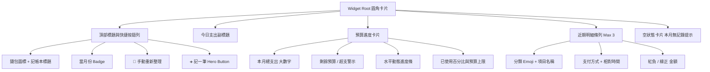

# UniTrack+ 桌面記帳小工具 (Expense Widget) 技術文件 💰

## 📖 模組概述

UniTrack+「桌面記帳小工具」(`ExpenseWidget`) 是專為大學生設計的高效個人收支即時管理工具。無需打開 App，即可在 Android 手機桌面掌握當月總支出、剩餘預算、今日花費與最新交易明細，並可透過桌面「記一筆」按鈕一鍵喚起記帳對話框，大幅降低記帳阻力。

---

## 📐 尺寸與佈局架構

* **Provider 設定**：[`app/src/main/res/xml/widget_expense_info.xml`](file:///d:/UniTrack+/app/src/main/res/xml/widget_expense_info.xml)
* **版面佈局**：[`app/src/main/res/layout/widget_expense.xml`](file:///d:/UniTrack+/app/src/main/res/layout/widget_expense.xml)
* **預設網格規格**：`3 × 2` (寬 180dp、高 110dp)
* **縮放模式**：`horizontal | vertical`
  * **標準尺寸 (3×2 / 4×2)**：完整顯示頂部統計列、預算進度卡、最新 3 筆收支交易明細與快捷操作區。
  * **精簡尺寸 (2×2)**：自動適配，聚焦本月支出、剩餘預算、今日花費與「記一筆」按鈕。



---

## ⚙️ 核心邏輯與生命週期

### 1. AppWidgetProvider 實作
* **核心類別**：[`ExpenseWidget.kt`](file:///d:/UniTrack+/app/src/main/java/com/example/widget/ExpenseWidget.kt)
* **非同步資料庫讀取**：在背景協程 (`Dispatchers.IO`) 中存取 Room 資料庫 (`AppDatabase`)：
  - 查詢 `ExpenseDao.getAllExpensesOnce()` 與 `ExpenseDao.getBudgetForMonthOnce()`
  - 依當前西元年月份 (`YYYY-MM`) 與日期 (`YYYY-MM-DD`) 統計本月支出與今日支出
  - 計算已用預算百分比與剩餘預算金額

### 2. 超支動態警示機制
* **正常狀態**：剩餘預算大於或等於 0，卡片呈淺藍底藍框 (`widget_expense_budget_bg.xml`)，顯示剩餘金額。
* **超支狀態**：當月支出大於預算上限，卡片切換為淺紅底紅框 (`widget_expense_budget_warning_bg.xml`)，進度條拉滿並變為紅色，標題變更為「已超支」並以玫瑰紅字體提示超支金額（如 `-$ 1,250 ⚠️`）。

### 3. 未登入隱私保護
* 自動偵測當前 Firebase 登入狀態與本機使用者 ID。
* 若未登入，強制隱藏預算卡片與收支列表，僅呈現「🔒 尚未登入帳號」空狀態卡片，防止桌面資料外洩。

---

## 🚀 互動行為與 Intent 路由

| 觸發元件 | Intent 行為 | 導航目標 |
| :--- | :--- | :--- |
| **小工具主體 (`widget_root`)** | `PendingIntent.getActivity` | 跳轉至 App 記帳本主頁 (`AppDestination.Expense.route`) |
| **「記一筆」按鈕 (`btn_widget_add_expense`)** | 攜帶 Extra: `quick_action = "add_expense"` | 直達記帳本並自動彈出「新增收支」對話框 |
| **重新整理按鈕 (`btn_widget_refresh`)** | `PendingIntent.getBroadcast` 發送 `ACTION_REFRESH_EXPENSE` | 重新向 Room 讀取資料並刷新 RemoteViews |

### 快捷記帳實作細節 (`MainActivity.kt` ↔ `ExpenseScreen.kt`)
1. 在 `MainActivity.kt` 的 `LaunchedEffect(currentIntent)` 攔截 `ExpenseWidget.EXTRA_QUICK_ACTION`。
2. 判定若為 `QUICK_ACTION_ADD_EXPENSE`，將狀態寫入 `quickAction` 並傳遞至 `ExpenseScreen(autoOpenAddDialog = true)`。
3. `ExpenseScreen` 在載入完成時自動彈出 `AddEditExpenseDialog`，記帳完畢後重置狀態。

---

## 🔄 即時連動更新機制 (Sync Triggers)

為了維持桌面資訊與 App 內的絕對一致，在 [`WidgetUpdateHelper.kt`](file:///d:/UniTrack+/app/src/main/java/com/example/widget/WidgetUpdateHelper.kt) 封裝廣播機制，並於 [`StudentViewModel.kt`](file:///d:/UniTrack+/app/src/main/java/com/example/ui/viewmodel/StudentViewModel.kt) 關鍵節點自動觸發更新：

```kotlin
// WidgetUpdateHelper.kt
fun updateExpenseWidget(context: Context) {
    sendUpdateBroadcast(context, ExpenseWidget::class.java)
}
```

* **自動觸發點**：
  1. **新增收支**：`StudentViewModel.addExpense()`
  2. **修改明細**：`StudentViewModel.updateExpense()`
  3. **刪除紀錄**：`StudentViewModel.deleteExpense()`
  4. **清空帳本**：`StudentViewModel.clearAllExpenses()`
  5. **設定預算**：`StudentViewModel.setMonthlyBudget()`
  6. **匯入測試資料**：`StudentViewModel.seedMockExpenses()`
  7. **帳號登出 / 登入 / 註銷**：`WidgetUpdateHelper.updateAllWidgets()`

---

## 🖥️ 小工具管理頁面整合

在 App 的「設定 ➔ 桌面小工具管理」([`WidgetSettingsScreen.kt`](file:///d:/UniTrack+/app/src/main/java/com/example/ui/screens/settings/WidgetSettingsScreen.kt)) 內：
* 新增「**記帳本小工具樣式**」高保真預覽卡片，支援動態載入使用者當前的記帳資料與預算狀態。
* 快速操作區新增「**前往記帳本與設定預算**」捷徑。
* 新增「**立即強制同步所有桌面小工具**」操作按鈕，點擊立即向系統廣播刷新課表與記帳小工具。
